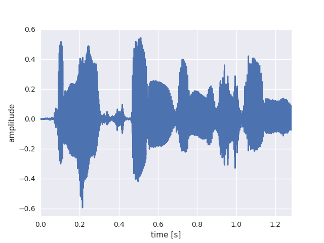
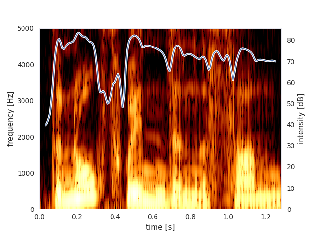

# Parselmouth - Praat in Python, the Pythonic way

[](https://pypi.python.org/pypi/praat-parselmouth)
[](https://gitter.im/PraatParselmouth/Lobby)
[](https://travis-ci.org/YannickJadoul/Parselmouth/)
[](https://ci.appveyor.com/project/YannickJadoul/parselmouth)
[](https://parselmouth.readthedocs.io/en/latest/?badge=latest)
[](https://github.com/YannickJadoul/Parselmouth/blob/master/LICENSE)

**Parselmouth** is a Python library for the [Praat](http://www.praat.org) software.

Though other attempts have been made at porting functionality from Praat to Python, Parselmouth is unique in its aim to provide a complete and Pythonic interface to the internal Praat code. While other projects either wrap Praat's scripting language or reimplementing parts of Praat's functionality in Python, Parselmouth directly accesses Praat's C/C++ code (which means the algorithms and their output are exactly the same as in Praat) and provides efficient access to the program's data, but *also* provides an interface that looks no different from any other Python library.

Please note that Parselmouth is currently in premature state and in active development. While the amount of functionality that is currently present is not huge, more will be added over the next few months.

Drop by our [Gitter chat room](https://gitter.im/PraatParselmouth/Lobby) if you have any question, remarks, or requests!

## Installation
Parselmouth can be installed like any other Python library, using (a recent version of) the Python package manager `pip`, on Linux, macOS, and Windows:
```
pip install praat-parselmouth
```
or, to update your installed version to the latest release:
```
pip install -U praat-parselmouth
```

For more detailed instructions, please refer to the [documentation](parselmouth.readthedocs.io/en/stable/installation.html).

## Example usage
```Python
import parselmouth

import numpy as np
import matplotlib.pyplot as plt
import seaborn
seaborn.set() # Use seaborn's default style to make graphs more pretty

# Plot nice figures using Python's "standard" matplotlib library
snd = parselmouth.Sound("~/z6a.WAVE")
plt.figure()
plt.plot(snd.xs(), snd.values)
plt.xlim([snd.xmin, snd.xmax])
plt.xlabel("time [s]")
plt.ylabel("amplitude")
plt.show() # or plt.savefig("sound.pdf")
```

```Python
def draw_spectrogram(spectrogram, dynamic_range=70):
    X, Y = spectrogram.x_grid(), spectrogram.y_grid()
    sg_db = 10 * np.log10(spectrogram.values.T)
    plt.pcolormesh(X, Y, sg_db, vmin=sg_db.max() - dynamic_range, cmap='afmhot')
    plt.ylim([spectrogram.ymin, spectrogram.ymax])
    plt.xlabel("time [s]")
    plt.ylabel("frequency [Hz]")

def draw_intensity(intensity):
    plt.plot(intensity.xs(), intensity.values, linewidth=3, color='w')
    plt.plot(intensity.xs(), intensity.values, linewidth=1)
    plt.grid(False)
    plt.ylim(0)
    plt.ylabel("intensity [dB]")

intensity = snd.to_intensity()
spectrogram = snd.to_spectrogram()
plt.figure()
draw_spectrogram(spectrogram)
plt.twinx()
draw_intensity(intensity)
plt.xlim([snd.xmin, snd.xmax])
plt.show() # or plt.savefig("spectrogram.pdf")
```

```Python
spectrogram = snd.to_spectrogram(window_length=0.05)
plt.figure()
draw_spectrogram(spectrogram)
plt.xlim([snd.xmin, snd.xmax])
plt.show() # or plt.savefig("spectrogram_0.05.pdf")
```

```Python
# Find all .wav files in a directory, pre-emphasize and save as new .wav and .aiff file
import glob
import os.path
from parselmouth import SoundFileFormat

for wave_file in glob.glob('/home/yannick/*.wav'):
    s = parselmouth.Sound(wave_file)
    s_pre = s.pre_emphasize()
    s.save(os.path.splitext(wave_file)[0] + '_pre.wav', SoundFileFormat.WAV)
    s.save(os.path.splitext(wave_file)[0] + '_pre.aiff', SoundFileFormat.AIFF)
```

## Documentation
Our documentation is available at [ReadTheDocs](http://parselmouth.readthedocs.io/). Soon, it will contain the API reference of Parselmouth, but until then, the existing API documentation can be found [here](http://ai.vub.ac.be/~yajadoul/parselmouth.html).

## Development
Currently, the actual project and Parselmouth's code is not very well documented. Or well, hardly documented at all. That is planned to still change in order to allow for easier contribution to this open source project.

Briefly summarized, Parselmouth is built using [`cmake`](https://cmake.org/). Next to that, to manually build Parselmouth, the only requirement is a modern C++ compiler supporting the C++14 standard.

## Acknowledgements
- Parselmouth builds on the extensive code base of [Praat](https://github.com/praat/praat) by Paul Boersma, which actually implements the huge variety of speech processing and phonetic algorithms that can now be accessed through Parselmouth.
- In order to do so, Parselmouth makes use of the amazing [pybind11](https://github.com/pybind/pybind11) library, allowing expose the C/C++ functionality of Praat as a Python interface.
- Special thanks go to [Bill Thompson](https://billdthompson.github.io/) and [Robin Jadoul](https://github.com/RobinJadoul/) for their non-visible-in-history but very valuable contributions.

## License
* Parselmouth is released under the GNU General Public License, version 3 or later. See [the `LICENSE` file](LICENSE) for details.

* [Praat](https://github.com/praat/praat) is released under [the GNU General Public License, version 2 or later](praat/main/GNU_General_Public_License.txt). Small changes to this code base, made in the context of Parselmouth, can be found within the `git` history.

  Parselmouth only exposes Praat's existing functionality and implementation of algorithms. If you use Parselmouth in your research and plan to cite it in a scientific publication, please do not forget to [*cite Praat*](http://www.fon.hum.uva.nl/praat/manual/FAQ__How_to_cite_Praat.html).

  > Boersma, Paul & Weenink, David (2017). Praat: doing phonetics by computer [Computer program]. Version 6.0.28, retrieved 23 March 2017 from [http://www.praat.org/](http://www.praat.org/)

* [pybind11](https://github.com/pybind/pybind11) is released under [a BSD-style license](pybind11/LICENSE).
